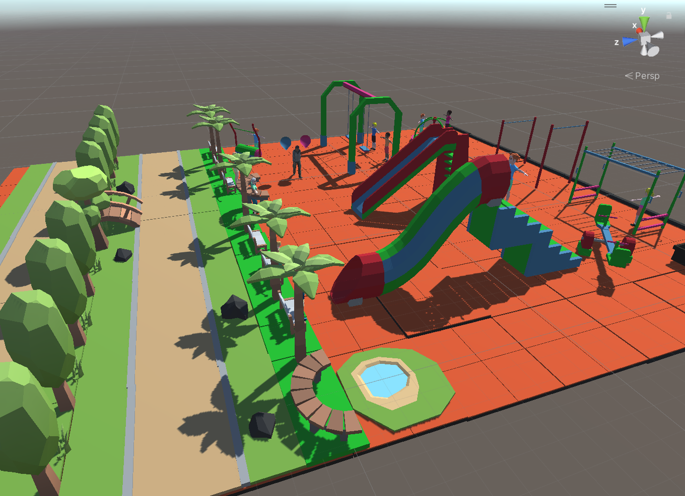
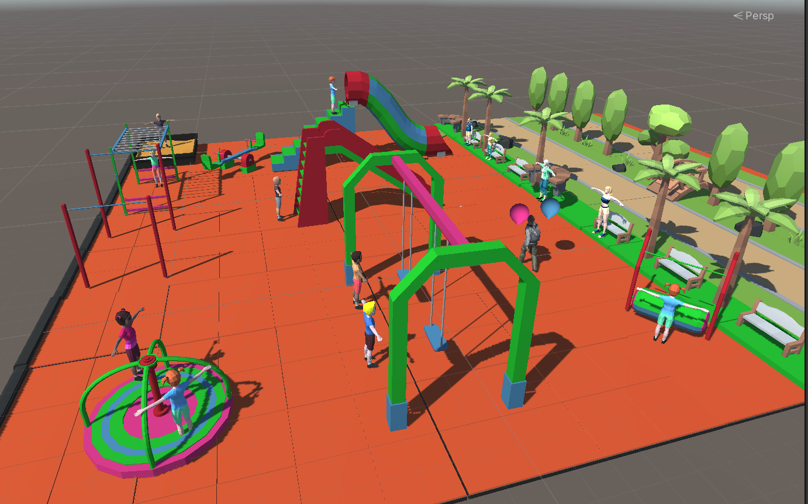

# Application for Teaching Counting to Preschool Children Using Augmented Reality with Unity

Learn to Count - Educational Game with Unity and Augmented Reality
This project is developed with the aim of teaching preschool children how to count in a fun and interactive way using Unity and Augmented Reality technologies.

Key Features
Virtual Park Environment: Provides a live 3D environment with children playing in the park, their families, and a balloon vendor.
Counting with Balloons: Children can learn to count by moving the balloons held by the balloon vendor.
Access via QR Code: When you scan the QR code to use the application, this amazing park scenario comes to life.
How to Use
Download and install the project on your device.
Launch the application.
Scan the QR code displayed on the screen.
Let your children or students have a great time learning to count while enjoying the live park environment.

Project Developers
Hasan Can Çelik-205541028

# Vuforia

1-Import and Set Up Vuforia: After importing the Vuforia SDK, follow the Vuforia setup wizard within Unity. It will guide you through the process of configuring Vuforia for your project.

2-Create a Vuforia Database: In the Vuforia developer portal, create a Vuforia database. This is where you'll configure your target images (which can include QR codes).

3-Upload and Configure the QR Code: Inside the Vuforia database, upload your QR code image as a target. Configure its size, rating, and other details as needed.

4-Download and Import the Database: Once your target is configured, download the database and import it into your Unity project.

5-Add the Image Target: In your Unity scene, add an "Image Target" game object. Configure it to use the database you imported, and select the QR code image as the target.

6-Create AR Content: Now, you can create your AR content that will appear when the QR code is recognized. This content could be 3D models, animations, or any AR elements you want to display
